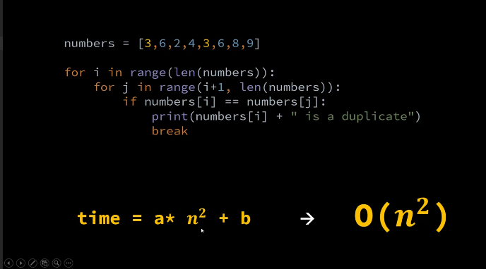
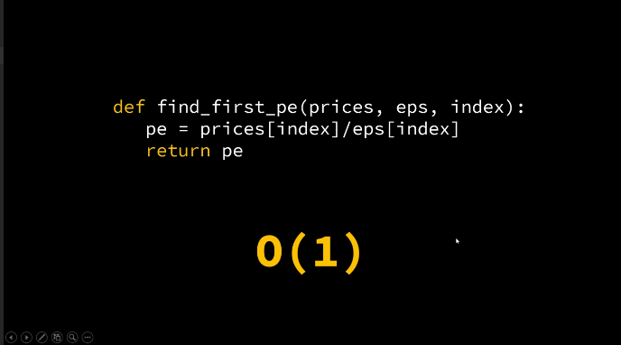
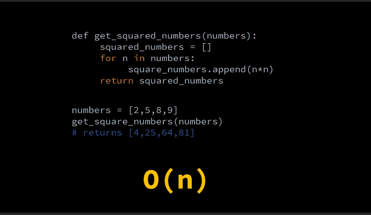

# Data Structures and Algorithms in Python
Credits: https://www.w3schools.com/python/ and https://www.youtube.com/playlist?list=PLeo1K3hjS3uu_n_a__MI_KktGTLYopZ12

Data Structures are the building blocks or raw materials for software programs.

## 1. Types of Data Structures:

- **List (Array)**
- **Dictionary (Hash Table)**

> 📌 **Note**: Python does not have a native implementation of Linked List. However, one can manually implement it using custom classes.

## 2. Big O Notation:

The formula for measuring performance growth:
 time = a * n + b

- **Time Complexity**: Represents the running time growth.
- **Space Complexity**: Represents the space (memory) growth.

### Common Time Complexities:

- **O(c)**: Constant - Algorithm performance doesn't change with dataset size.
- **O(n)**: Linear - Work scales linearly with dataset size.
- **O(n^2)**: Quadratic - Seen in algorithms with nested iterations.
- **O(n^3)**: Cubic - Less frequent, seen with three nested loops.
- **O(2^n)**: Exponential - Performance deteriorates rapidly with dataset growth.
- **O(log(n))**: Logarithmic - Work increases by a constant when dataset size doubles.
- **O(nlog(n))**: Log Linear - Common in algorithms that divide dataset in each iteration (e.g., many sorting algorithms).

#### Performance From Fastest to Slowest:

1. O(c)
2. O(log(n))
3. O(n)
4. O(nlog(n))
5. O(n^2)
6. O(n^3)
7. O(2^n)

## 3. Arrays in Python:

In Python, the `list` serves the purpose of an array. It is implemented as a **dynamic array**.

- **Static Array**: Has a fixed size. Cannot add elements once it's full.
  
- **Dynamic Array**: Can grow to accommodate new elements, though this increases time and space complexity. The resizing often follows a Geometric Progression.

### Features:

Lists can store elements like numbers, text, and more complex objects.

**Common List Operations**:

- `len()`: Determine the number of items.
- `append()`: Add an item at the end.
- `insert()`: Add an item at a specific index.
- `remove()`: Remove a specific item.
- `pop()`: Remove an item from a specified index (or the last item if no index is specified).
- `clear()`: Empty the list.
- `sort()`: Sort the list. For descending order, use `sort(reverse=True)`.

