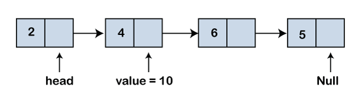
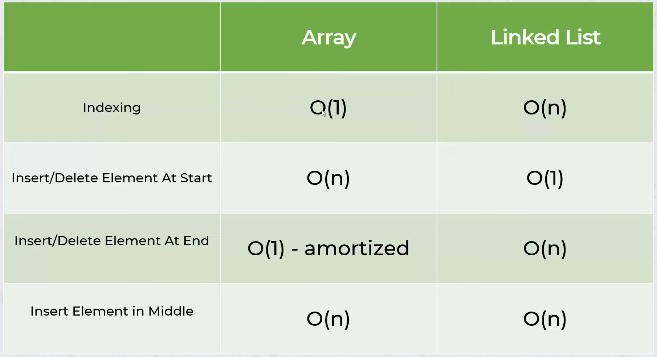

# Data Structures and Algorithms in Python
Credits: https://www.w3schools.com/python/ and https://www.youtube.com/playlist?list=PLeo1K3hjS3uu_n_a__MI_KktGTLYopZ12

Data Structures are the building blocks or raw materials for software programs.

## 1. Types of Data Structures:

- **List (Array)**
- **Dictionary (Hash Table)**

> 📌 **Note**: Python does not have a native implementation of Linked List. However, one can manually implement it using custom classes.

## 2. Big O Notation:

The formula for measuring performance growth:
 time = a * n + b

- **Time Complexity**: Represents the running time growth.
- **Space Complexity**: Represents the space (memory) growth.

### Common Time Complexities:

- **O(c)**: Constant - Algorithm performance doesn't change with dataset size.
- **O(n)**: Linear - Work scales linearly with dataset size.
- **O(n^2)**: Quadratic - Seen in algorithms with nested iterations.
- **O(n^3)**: Cubic - Less frequent, seen with three nested loops.
- **O(2^n)**: Exponential - Performance deteriorates rapidly with dataset growth.
- **O(log(n))**: Logarithmic - Work increases by a constant when dataset size doubles.
- **O(nlog(n))**: Log Linear - Common in algorithms that divide dataset in each iteration (e.g., many sorting algorithms).

#### Performance From Fastest to Slowest:

1. O(c)
2. O(log(n))
3. O(n)
4. O(nlog(n))
5. O(n^2)
6. O(n^3)
7. O(2^n)

## 3. Arrays in Python:

In Python, the `list` serves the purpose of an array. It is implemented as a **dynamic array**.

- **Static Array**: Has a fixed size. Cannot add elements once it's full.
  
- **Dynamic Array**: Can grow to accommodate new elements, though this increases time and space complexity. The resizing often follows a Geometric Progression.

### Features:

Lists can store elements like numbers, text, and more complex objects.

**Common List Operations**:

- `len()`: Determine the number of items.
- `append()`: Add an item at the end.
- `insert()`: Add an item at a specific index.
- `remove()`: Remove a specific item.
- `pop()`: Remove an item from a specified index (or the last item if no index is specified).
- `clear()`: Empty the list.
- `sort()`: Sort the list. For descending order, use `sort(reverse=True)`.

## 4. Linked List
 

 Linked list has two main benefits over an array:
 - don't need to pre-allocate space
 - easier insertion
 

## 5. Hash Table:
 
 Hash map or hash table is a very popular data structure. It allows to store key, value pairs and using key you can locate a value in **O(1)** or constant time
 
 # 5.1 Collision Handling:
 Methods to avoid collisions:
     - `Chaining`: make each cell of hash table point to a linked list of records that have same hash function value.
     - `Linear Probing`: looking for a free place in hash table to store the value.
 
 ## 6. Stack:
 LIFO ( Last in first out ) or FIFO(First in first out) data structure where we keep on pushing elements and when we say pop it removes the last pushed element. It is dynamic array(list)
 
 Push/Pop element: **0(1)**
 Search element by value: **O(n)**
 
 ---- Use cases for stack:
   - Function calling
   - Undo functionality
 
  
- `deque()`: preferred over a list in the cases where we need quicker append and pop operations from both the ends of the container, as deque provides an **0(1)** time complexity for append and pop operations as compared to a list that provides **O(n)** time complexity.
- `empty()`: Returns whether the stack is empty - **0(1)**
- `size()` : Returns the size of the stack - **0(1)**
- `top() / peek()` : Returns a reference to the topmost element of the stack - **0(1)**
- `push(a)` : Inserts the element ‘a’ at the top of the stack - **0(1)**
- `pop()` : Deletes the topmost element of the stack - **0(1)**
 

## 7. Queue 
 
 Queue is a linear data structure that stores items in First in First Out **(FIFO)**.

## 5. Hash Table:
 
 Hash map or hash table is a very popular data structure. It allows to store key, value pairs and using key you can locate a value in **O(1)** or constant time
 
 # 5.1 Collision Handling:
 Methods to avoid collisions:
     - `Chaining`: make each cell of hash table point to a linked list of records that have same hash function value.
     - `Linear Probing`: looking for a free place in hash table to store the value.
 
 ## 6. Stack:
 LIFO ( Last in first out ) or FIFO(First in first out) data structure where we keep on pushing elements and when we say pop it removes the last pushed element. It is dynamic array(list)
 
 Push/Pop element: **0(1)**
 Search element by value: **O(n)**
 
 ---- Use cases for stack:
   - Function calling
   - Undo functionality
 
  
 - `deque()`: preferred over a list in the cases where we need quicker append and pop operations from both the ends of the container, as deque provides an **0(1)** time complexity for append and pop operations as compared to a list that provides **O(n)** time complexity.
- `empty()`: Returns whether the stack is empty - **0(1)**
- `size()` : Returns the size of the stack - **0(1)**
- `top() / peek()` : Returns a reference to the topmost element of the stack - **0(1)**
- `push(a)` : Inserts the element ‘a’ at the top of the stack - **0(1)**
- `pop()` : Deletes the topmost element of the stack - **0(1)**
 

 - `Enqueue`: Adds an item to the queue. If the queue is full, then it is said to be an Overflow condition – Time Complexity : **O(1)**
 - `Dequeue`: Removes an item from the queue. The items are popped in the same order in which they are pushed. If the queue is empty, then it is said to be an Underflow condition – Time Complexity : **O(1)**
 - `Front`: Get the front item from queue – Time Complexity : **O(1)**
 - `Rear`: Get the last item from queue – Time Complexity : **O(1)**

- `maxsize` – Number of items allowed in the queue.
- `empty()` – Return True if the queue is empty, False otherwise. 
- `full()` – Return True if there are maxsize items in the queue. If the queue was initialized with maxsize=0 (the default), then full() never returns True.
- `get()` – Remove and return an item from the queue. If queue is empty, wait until an item is available.
- `get_nowait()` – Return an item if one is immediately available, else raise QueueEmpty.
- `put(item)` – Put an item into the queue. If the queue is full, wait until a free slot is available before adding the item.
- `put_nowait(item)` – Put an item into the queue without blocking. If no free slot is immediately available, raise QueueFull.
- `qsize()` – Return the number of items in the queue.
